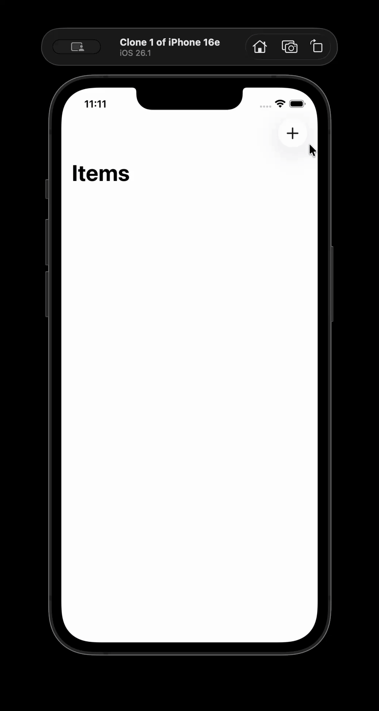

# 02-bookstore · SwiftUI Item Board

## Overview

- SwiftUI 리스트 기반 아이템 보드를 통해 OBSD 루트/플로우 분리를 연습하는 프로젝트입니다.
- Core Data 모드와 Mock 모드를 `SystemMode` 값 하나로 교체하며 경계 테스트를 쉽게 실행할 수 있습니다.

## Highlights

- `ItemBoard`가 생성/조회/삭제 흐름을 묶어두고 SwiftUI `task`에서 직접 호출됩니다.
- `ItemBoxFlow`는 실서비스/더블 구현을 모두 제공해 주입만으로 실행 환경을 전환합니다.
- `Item` 값 객체는 UI가 필요한 최소 필드만 노출해 View가 단순 상태만 관찰합니다.

## Run

1. `bookstore.xcodeproj`를 Xcode 15+에서 열고 대상 기기 또는 시뮬레이터를 선택합니다.
2. `Cmd+R` 실행 시 `ItemBoardView`가 자동으로 `fetchItems()`를 호출해 저장소를 동기화합니다.

## Tech Stack

- Swift 5.9+, Swift Concurrency(`async/await`, `@MainActor`)
- SwiftUI `NavigationStack`, `List`, `@State`
- Core Data (`NSPersistentContainer`)

## Demo

